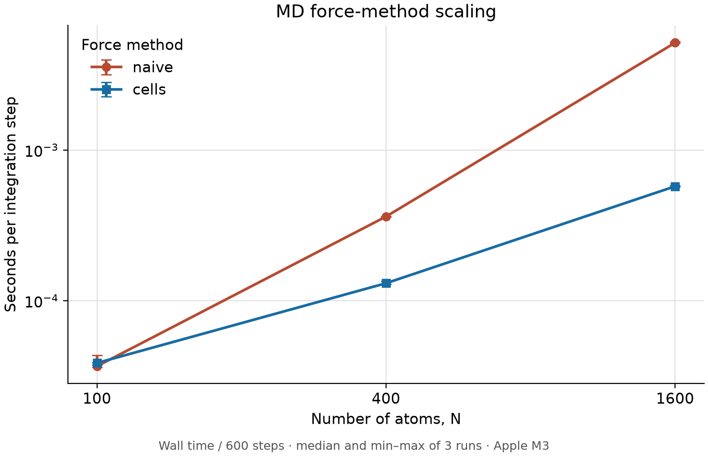

# Week 2

Generate the dimer energy-error plot from the repository root:

```sh
cargo run --manifest-path week2/md/Cargo.toml --example dimer
```

## Lennard–Jones fluid

From `week2/`:

    make reproduce
    md/target/release/md check artifacts
    md/target/release/md video artifacts --out artifacts/run.mp4

Video requires ffmpeg with libx264. Install ffmpeg first (on macOS, `brew install ffmpeg`).
The default run uses 100 atoms, density 0.8, target temperature 0.5, dt 0.01,
2000 equilibration steps, 10000 production steps, sampling every 50 steps, and seed 2026.
It writes run.json and 200 production frames to traj.jsonl. Production step zero is not saved.

For options, run `md/target/release/md run --help`. To install the `md` command:

    cargo install --path md

The thermostat uses 2N-2 degrees of freedom during equilibration. Saved-speed temperature
uses mean(v²)/2. Check recomputes energy and speed statistics from saved states and exits
unsuccessfully if data are malformed or any of the three physical checks fails.
The video shows the cumulative 100-bin RDF, its long-range contrast, and one image per
saved state at 30 fps. Generated files are excluded from Git.

## Pages

[Open the molecular dynamics viewer](https://ispann.github.io/AMAT5315-2026Fall-Exercise/).

## Timing

  | Program | Median (s) | Range: min–max (s) |
  | --- | ---: | ---: |
  | NumPy week2-sim.py | 3.598 | 3.552–3.601 |
  | Rust debug | 7.174 | 7.011–8.217 |
  | Rust release | 0.372 | 0.371–0.374 |

## Benchmark

Three runs per force method and N on an Apple M3 (arm64, macOS 26.6.2), using the
installed optimized Rust build with debug symbols and frame pointers:

```sh
md run --force naive --n 100 --steps 500 --eq-steps 100 --out <unique-directory>
md run --force cells --n 100 --steps 500 --eq-steps 100 --out <unique-directory>
```

Repeat for N = 400 and 1600; all other parameters use their defaults (no temperature
ramp). Runs execute sequentially, alternating which method runs first in each pair.
Times are elapsed wall-clock seconds, including process startup and writing 10 frames.
Each entry is the median (min–max). Speedups are calculated as naive / cells within
each of the three trial pairs, then summarized by their median and range.

| N | naive (s) | cells (s) | speedup = naive / cells |
| ---: | ---: | ---: | ---: |
| 100 | 0.022118 (0.021863–0.026148) | 0.023242 (0.022624–0.023508) | 0.966× (0.941–1.125×) |
| 400 | 0.217425 (0.216590–0.217517) | 0.078558 (0.077767–0.080826) | 2.768× (2.691–2.785×) |
| 1600 | 3.089659 (3.080225–3.142572) | 0.344967 (0.341864–0.349475) | 8.956× (8.814–9.192×) |

The plot divides total wall time by all 600 integration steps (100 equilibration +
500 production). Both axes are logarithmic; error bars show min–max across three runs.


